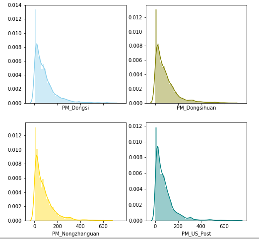

# Week 3   

```{r,echo=F}
knitr::opts_chunk$set(message = F, warning = F,cache=T)
```


## 工具总结  


一项在可视化工作者中的调查 [2018 visualization survey](https://medium.com/@Elijah_Meeks/2018-data-visualization-survey-results-26a90856476b)列举出了一些最常用的工具：R、Python、Tableau、D3.js、Adobe Illustrator。  


```{r,echo=F,fig.cap="Of the 627 people who filled out the survey, all but 133 indicated they used R, Illustrator or D3 in their data visualization practice with many using some combination of those tools. \n Source: https://medium.com/p/you-can-design-a-good-chart-with-r-5d00ed7dd18e?_branch_match_id=654159897912656642"}
knitr::include_graphics("images\\3_visualization_survey.png")
```


一些 ggplot2 的扩展包：ggvis 和 gganimate(增添动态图)、ggpubr、bbplot( BBC 数据新闻团队提供了一套主题设置)、ggrepel(自动调整标签位置)。  

其他一些好用的 JavaScript 库： leaflet（交互地图）、echarts、highcharts、p5.js(processing 在 js 上的实现)  


其他工具：  

1. [qlik](https://www.qlik.com/us/): 试用之后感觉和 Tableau 类似，但分析功能更加完善 
2. [Power BI](https://powerbi.microsoft.com/zh-cn/): 微软开发的 BI 工具，和 Excel、Power View、Power Pivot 协作的功能比较完善，但其使用的 DAX 语法适用面有些窄  
3. [Datawrapper](https://app.datawrapper.de/chart/QEKrm/upload): 基于网页在线创建的图表工具  
4. [venngage](https://venngage.com/): 主要用于做信息图  


## 案例：城市 PM2.5  

**Source**:  https://www.kaggle.com/uciml/pm25-data-for-five-chinese-cities/download  

数据集包含 2010 年至 2015 年北京、上海、广州、成都和沈阳五个城市的 PM2.5 细颗粒物指数及其他相关测量指标，出自 [Liang, X., S. Li, S. Zhang, H. Huang, and S. X. Chen (2016), PM2.5 data reliability, consistency, and air quality assessment in five Chinese cities, J. Geophys. Res. Atmos., 121, 10220–10236](https://agupubs.onlinelibrary.wiley.com/doi/full/10.1002/2016JD024877) 


导入数据：  

```{r,message=F}
library(tidyverse)
bj <- read_csv("data/BeijingPM20100101_20151231.csv",
               col_types = cols(
  PM_Dongsi = col_double(),
  PM_Dongsihuan = col_double(),
  PM_Nongzhanguan = col_double(),
  PM_US_Post = col_double(),
  year = col_integer(),
  month = col_integer(),
  day = col_integer(),
  hour = col_integer(),
  season = col_character(),
  .default = col_guess()))  %>%
        filter(year == 2015)
```


各变量分别为：  

* `No`: 行标签  
* `year`、`month`、`day`、`hour`、`season`: 标志该条纪录的日期   
* `PM`: 直径小于等于 2.5 微米的颗粒物浓度($ug/m^3$)  
* `DEWP`: 露点温度，即空气中所含的气态水达到饱和而凝结成液态水所需要降至的温度。(摄氏度)  
* `HUMI`: 湿度  
* `TEMP`: 温度(摄氏度)  
* `PRES`: 压强($hPa$)  
* `cdwd`: 组合风向(combined wind direction)    
* `lws`: 累计风速(cumulative wind speed)    
* `precipitation`: 每小时降水量($mm$)  
* `Iprec`: 累积降水量  


### 预处理  

```{r}
bj
```


对于这里的分析(20015 年北京市数据)，行索引 `No`  属于冗余变量，将它们从数据中去除： 


```{r}
bj <- bj %>%
  select(-No)
```

将 `year`、`month` 和 `day` 统一为一个日期变量：  
```{r}
bj$date <- lubridate::make_datetime(bj$year, bj$month, bj$day, bj$hour)
bj <- bj %>%
  select(date, everything()) %>%
  select(-year, -month, -day, -hour)
```


将季节变量 `Season` 重新编码：    

```{r}
bj$season <- fct_recode(bj$season,
                        "Spring" = "1",
                        "Summer" = "2",
                        "Fall" = "3",
                        "Winter" = "4")
```


在北京市的数据集中，`PM_DOngsi`、`PM_Dongsihuan`、`PM_Nongzhanguan` 分别代表东四十条、、和农业展览馆三个测量点的观测值，由中国生态环境部负责。`PM_US_Post`来自[美国使馆数据](http://www.stateair.net/web/post/1/1.html)。可见 http://aqicn.org/city/beijing/dongchengdongsi/cn/


聚合上面提到的四列，并移除带有缺失值的观测：  

```{r}
bj <- bj %>% 
  gather(key = Region, value = PM, 3:6) %>%
  select(date, season, Region, PM, everything()) %>%
  na.omit()
bj$Region <- str_replace(bj$Region, "PM_", "")
```

整理数据结果：  

```{r}
bj
```


### PM 2.5 测量的分布  

[原论文](https://agupubs.onlinelibrary.wiley.com/doi/full/10.1002/2016JD024877) 的一个研究主题是中国生态环境局 PM 2.5 测量数据的可靠性（与美国使馆发布数据相比），故本节主要关注 `PM` 在四个测量来源上的分布情况对比。 

以季节为分组变量，考察四个位点上 PM 2.5 测量值的分布情况：  

```{r,fig.height=8,fig.asp=0.9}
library(ggridges)
library(viridis)
ggplot(bj, aes(PM, season, fill = Region)) + 
  stat_density_ridges(geom = "density_ridges_gradient",alpha = 0.5,
                      calc_ecdf = T) + 
    scale_fill_viridis(discrete = T, name = "PM 2.5", option = "C", 
                       direction = -1, alpha = 0.3) + 
  theme_ridges() + 
  labs(title = "Distribution of PM 2.5 across months",
       subtitle = "Beijing: 2015",
       y = NULL)
```

山脊图显示，除了秋季(10,、11 和 12 月)以外，PM 2.5 的测量值在四个位点上的分布至少没有显著差异。秋季的这种例外可能是由于样本数过少导致———— 原文中提到，2015 年 10 月以后东四环测量点有超过 85 % 的缺失值，在数据预处理中，这些观测均被移除了。  


**另外一种呈现方式**： 小提琴图 + 箱线图 + 散点图  

```{r,fig.width=8}
## 自定义几何对象 `geom_flat_violin()` 来自 
## https://gist.github.com/dgrtwo/eb7750e74997891d7c20
source("R/geom_flat_violin.R")
windowsFonts(Helvetica = "TT Arial")

ggplot(bj, aes(Region, PM, fill = Region)) + 
  geom_flat_violin(position = position_nudge(x = 0.25)) + 
  geom_boxplot(width = 0.1, fill = "white", outlier.size = 0.2,
               position = position_nudge(x = 0.25)) + 
  stat_summary(geom = "point", fun.y = "mean", shape = 21, 
               position = position_nudge(0.25)) + 
  geom_jitter(shape = 21, width = 0.05, size = 0.5, alpha = 0.2) + 
  bbplot::bbc_style() + 
  theme(axis.text.x = element_text(size = 12),
        legend.text = element_text(size = 14),
        plot.title = element_text(size = 22)) + 
  labs(title = "PM concentration measured at four sites",
       subtitle = "Beijing: 2015")
```


下面，考虑不同季节内各个测量点的 PM 2.5 平均值的差异，首先得到所需数据：  

```{r,height=7,width=0.8}
library(ggpubr)

df1 <- bj %>% 
     group_by(Region, season) %>% 
     summarize(mean = round(mean(PM)))
df1
```


绘图：  

```{r}
p <- ggdotchart(df1,
  x = "Region",
  y = "mean",
  rotate = T,
  color = "season",
  sorting = "descending",
  add = "segments",
  add.params = list(color = "lightgrey", size = 2),
  dot.size = 6,
  label = df1$mean,
  font.label = list(color = "white", size = 9, vjust = 0.5)
)


facet(p, facet.by = "season",short.panel.labs = T) + 
  theme(axis.title.y = element_blank(),
        axis.text.y = element_text(size = 10)) + 
  labs(title = "Mean PM measureed at four sites",
       subtitle = "Beijing: 2015")
```


### 其他工具  

#### plotly  

plot.js、D3.js、hightcharts.js 等 JavaScript 库 提供了创建动态、交互图形的简洁语法，这是 ggplot2 的弱点，因为 *The grammer of graphics* 并没有描述动态成分在图形语法中的地位，不过这几年逐渐完善的 gganimation 包似乎改善了这一点，很多 JS 库也提供了 R 语言的接口。  

下面是一个用 plotly 绘制的简单散点图 (PM 与湿度，随机选取 500 个样本点)：  

```{r,message=F,echo= F}
library(plotly)

plot_ly(data = bj[sample(nrow(bj), 500), ], x = ~PM, y = ~HUMI, 
        color = ~Region, colors = "RdBu")
```


#### python  

这里只对各个地点 PM 测量作一个简单的直方图（使用原始数据）：  

```r
import matplotlib.pyplot as plt
import pandas as pd
import seaborn as sns 

data = pd.read_csv("bj.csv")

f, axes = plt.subplots(2, 2, figsize=(15, 15), sharex=True)
sns.distplot(data["PM_Dongsi"] , color="skyblue", ax=axes[0, 0]);
sns.distplot(data["PM_Dongsihuan"] , color="olive", ax=axes[0, 1]);
sns.distplot(data["PM_Nongzhanguan"] , color="gold", ax=axes[1, 0]);
sns.distplot(data["PM_US_Post"] , color="teal", ax=axes[1, 1]);
```

```{r,echo=F,fig.cap="A simple histogram using seaborn"}

```

大图可见： https://nbviewer.jupyter.org/github/enixam/Advanced_ggplot2/blob/master/bj.ipynb

个人感觉基于 matplotlib 的 python 可视化库往往有一些通病：如函数、参数的命名规范比较混乱，类似 ggplot2 中的主题设置比较繁琐。最重要的，核心的创建子图的语法经常不符合 tidy data 的要求。

#### Tableau  

数据处理和较为进阶的分析功能是 Tableau 的最大短板，可能需要先在 R、 Python 中整理好数据，随后才能在 Tableau 中完成可视化。    

```{r}
bj_tableau <- bj

bj_tableau$month <- lubridate::month(bj$date)
bj_tableau <- bj_tableau %>% 
  group_by(Region, month) %>% 
  summarize(PM_avg = mean(PM))
write_csv(bj, "data/bj_tableau.csv")
```

呈现：  

https://public.tableau.com/profile/qiushi1969#!/vizhome/beijing_PM/Sheet1?publish=yes


