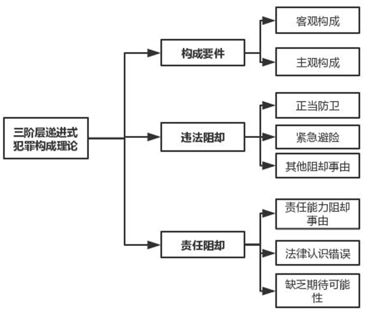

# Week 5 ~ 6  


### intro  

```{r,echo=F}
knitr::opts_chunk$set(warning = F, message = F, echo = F)
```


```{r,message=F}
library(tidyverse)
library(dygraphs)
```


2019 年两会期间，30 名人大代表基于近年来诸多未成年犯罪恶性事件，提交了关于将我国刑事责任年龄划分整体下调两岁的议案。刑事责任年龄制度是我国刑法体系中重要的组成部分，故进一步探讨该议案是否得当之前，不妨先回溯一下刑事责任年龄在整个刑法体系中的地位。  


受大陆法系中的德日分支影响，我国刑法中的犯罪论体系主要采用“三阶层”说。一种行为是否是犯罪，首先要看行为人主观和客观两方面是否满足法条所叙述的情形，即构成要件。如故意杀人罪名的构成要件是主观上有故意，客观上造成了他人死亡。如果满足了构成要件，则推定该行为具备违法性，此时要从反方面考虑是否存在正当防卫、紧急避险等违法阻却事由。如存在，则该行为不违法，也就更不可能是犯罪。如果没有违法阻却事由，则进入三阶层体系的最后一个阶段，如果行为人犯下了违法行为，同时也对该行为负有责任，也就应该被惩罚。此时，同样要从反方面思考，是否有一些原因使得行为人虽然犯下了违法行为，但应该不予处罚或减轻处罚呢？年龄正是一个重要的推翻有责性的原因，未成年人的知识水平和治理成熟程度不足，缺乏控制和善恶是非的辨认能力，不宜与成年人相同对待，于是便有了 14 岁以下无刑事责任， 14 岁 ~ 18 岁减轻处罚等规定的出现。（由此也可见“14 岁以下杀人不犯法”等说法的不精确之处）

```{r,out.width="80%",fig.cap="Source: https://www.bilibili.com/read/cv2456269"}

```


《中华人民共和国刑法》第十七条第二款规定：  

> 已满十六周岁的人犯罪，应当负刑事责任。已满十四周岁不满十六周岁的人，犯故意杀人、故意伤害致人重伤或者死亡、强奸、抢劫、贩卖毒品、放火、爆炸、投毒罪的，应当负刑事责任。已满十四周岁不满十八周岁的人犯罪，应当从轻或者减轻处罚。因不满十六周岁不予刑事处罚的，责令他的家长或者监护人加以管教；在必要的时候，也可以由政府收容教养。  

不难看出，我国现行刑法采取三分法规定刑事责任年龄[@xxp2002]：  

* 不满$14$岁：无刑事责任阶段  
* 已满$14$岁不满$16$岁：相对负刑事责任阶段（只对八种重大犯罪）  
* 已满$16$岁：完全刑事责任年龄阶段  


```{r}
offenders <- read_csv("data/offenders.csv",
                      col_types = cols(year = col_date(format = "%Y"),
                                       .default = col_guess())) 

under_18 <- ts(offenders$under_18, start = 1997, frequency = 1)
between_18_and_25 <- ts(offenders$between_18_and_25, start = 1997, frequency = 1)
young_offenders <- cbind(under_18, between_18_and_25)
```

### 近年中国未成年犯罪概览

自 97 刑法 ^[相比于 79 刑法，97 刑法收紧了相对刑事责任年龄人承担刑事责任年龄的范围] 颁布以后的二十年间，我国青少年犯罪 ^[很多场合“未成年犯罪”和“青少年犯罪”混同使用。前者是严格明确的法定概念（小于 18 岁），但也导致相应研究的局限性，无法客观描述和评价当前的犯罪形势，因为在犯罪学上仍大量同时使用“青少年犯罪”这一概念，通常将 18 岁 ~ 25 岁之间的成年人也包括在研究对象之内，从而形成对相近年龄阶段主体的犯罪行为的连续型研究。故在犯罪统计上，也经常性将 25 岁以下的青少年作为刑事统计的对象] 经历了一个先升后降的过程。1997 ~ 2006 年的十二年间，未成年罪犯总数增加近300%，绝对数峰值接近 10 万人。2007 年以后，未成年罪犯和青少年罪犯人数大体上一路下滑，直到 2017 年的 3 万人左右，平均降低率超过 10 %。[@linwei2010stat]

```{r}
dygraph(young_offenders, main = "China's young / minor offenders on the wane") %>% 
  dySeries("under_18", label = "under 18") %>%
  dySeries("between_18_and_25", label = "Between 18 and 25") %>% 
  dyLegend(width = 400) %>%
  dyOptions(colors = RColorBrewer::brewer.pal(3, "Set1"), 
            drawPoints = TRUE, pointSize = 2,
            stepPlot = T) %>% 
  dyRangeSelector(height = 20, dateWindow = c("2006-01-01", "2018-01-01")) %>% 
  dyAxis("y", axisLineWidth = 1.5, axisLineColor = "navy", gridLineColor = "lightblue") %>% 
  dyAxis("x", axisLineWidth = 1.5, axisLineColor = "navy",drawGrid = FALSE) %>%
  dyHighlight(highlightCircleSize = 5, 
              highlightSeriesBackgroundAlpha = 0.2,
              hideOnMouseOut = FALSE)
```

```{r}
library(gt)
offenders %>% 
  select(1:2) %>% 
  mutate(last = lag(under_18)) %>% 
  mutate(Rate_of_Decrease = (under_18 - last) / under_18) %>% 
  select(1, 2, 4) %>% 
  filter(!is.na(Rate_of_Decrease), Rate_of_Decrease > 0) %>% 
  rename(`Under 18` = under_18,
         Year = year,
         `Rate of Decrease` =  Rate_of_Decrease) %>%
  gt() %>% 
  tab_header(
    title = "Rate of Decrease of Minor Offenders in Mainland China",
    subtitle = "1997 ~ 2017") %>%
  fmt_date(
    columns = vars(Year),
    date_style = "year"
  ) %>%
  fmt_number(
    columns = vars(`Under 18`),
    sep_mark = ","
  ) %>%
  fmt_percent(
    columns = vars(`Rate of Decrease`)
  )
```

国家统计局网站和近年的中国法律年鉴上没有给出更为精确的数据，如犯罪类型划分，14 ~ 16 岁罪犯人数等情况。这部分数据只能一定程度上参考最高人民法院发布的司法数据专题以及学术论文。  

分别于 2017、2018 年由最高人民法院发布的[司法大数据专题报告：未成年人犯罪](http://www.court.gov.cn/upload/file/2017/11/30/13/20/20171130132016_65864.pdf) 和 [从司法大数据我国未成年人权益司法保护和未成年人犯罪特点及其预防](http://www.court.gov.cn/upload/file/2018/06/01/10/12/20180601101246_54227.pdf) 均指出，未成年中涉抢劫罪、故意伤害罪和强奸罪的恶性案件数量总体呈下降趋势，16 周岁以上未成年人犯罪占比近九成。  

@shen2016age 认为，中国的刑事责任年龄政策较好地遏制了恶性案件在 14 ~ 16 年龄段的发生频率。@lq2014 通过 10 个省 1000 余个样本的抽样调查中指出：未成年人犯罪具有低龄化特征，尤其是 14 岁所占的比例增长较快，低龄化趋势在故意杀人罪、抢劫罪等社会危害极其巨大的恶性犯罪、暴力犯罪领域特别突出。

出于《未成年人保护法》、《预防未成年人犯罪法》等确立的保护制度， 不满 14 岁的无责犯罪少年的相关数据难以获得，而这恰恰是当下群情激愤疾呼修法之民众所咬牙切齿的重点。私自揣测，未成年犯罪整体被遏制的背景下，其中的一个子群体该不会呈现显著相反的变动。即便我国的犯罪低龄化、恶性化真如媒体叙事那般愈演愈烈，我也以为这种动议失之片面，至少是过于草率。在我国未成年人犯罪整体趋好的大趋势下，整体刑事责任年龄门槛下调两年的这样的大手笔很难经得起推敲，因为这是对其他年龄阶段未成年人一种不公的对待，无谓地消耗国家的司法资源。即便只将无刑事责任年龄阶段下调至 12 岁，其他阶段不动，也会引起整个犯罪论体系的崩塌。

从另一种似乎有些精英主义的角度观察，法律要倾听民众的声音，但法律更要超越民众的偏见.聂树斌案、呼格吉勒案，念斌投毒案，皆是群情激愤，人人皆曰可杀。如果所谓的民意和媒体叙事控制了我们的律法方向，民众只会越来越不相信司法，用私人的价值观揣度虚幻的公平与正义，用多数人的情感淹没理性独立的判断。一旦开启媒体故事控制立法之先河，后果将不堪设想。卫报的一篇[报道](https://www.theguardian.com/commentisfree/2019/nov/04/the-guardian-view-on-the-age-of-criminal-responsibility-raise-it-now)批评英国政府因一桩 90 年代的未成年犯罪恶性事件下调刑事责任年龄，导致下一代、下下一代承受出生他们以前由别人犯下事件的恶果，如今我们也走到了相似的十字路口。  


### 另一条路  

> 最好的社会政策才是最好的刑事政策。  

这是德国著名刑法学家李斯特说过的经典名言。在预防犯罪方面起到更重要作用的不是严刑峻法，而是社会的大环境.以职务犯罪为例，有关贪污贿赂犯罪的法定刑一直很高，设有死刑，以及终身监禁，但是近年以来，职务犯罪减少的根本原因不仅在于刑法的威慑作用，更重要的一点是社会政策的疏导，例如“高薪养廉”、“社会监督”等，对于职务犯罪的抑制都起到了至关重要的作用。因此，刑法不仅仅是让法律条文发挥一般预防和特殊预防的作用，还应该从社会政策上考虑如何降低犯罪，保护公民安全。([法治的细节︱是孩童还是罪犯？关于刑事责任年龄的道路选择](https://www.thepaper.cn/newsDetail_forward_3422756))   

2014 年中国青少年研究中心在 12 个省区[调查](http://politics.people.com.cn/n/2015/0421/c70731-26875819.html)发现，教养方式不当和不良家庭结构是导致未成年人走上犯罪道路的重要因素[@jiaoyu2015]。@shao2019intermittent 认为，紧张的家庭关系导致的间歇性狂暴症倾向是大量青少年冲动犯罪的重要原因。@gqs2019、@cqx2018、@lq2014、@linwei2010stat 均指出未成年罪犯平均文化水平低于初中，在校成绩不好，学校缺乏管教等问题。@ylr2019 总结了目前我国未成年司法审判存在的弊端。可以说，社会政策预防矫正未成年犯罪上仍大有可为。  

一些改革路径总结如下：  

* 健全收容教育制度  
  收容教育制度是教育惩戒未满十四岁无责犯罪少年的的重要手段。@lj2019 指出现有该制度的一些现有缺陷，如缺乏法律依据，适用对象不明确，适用条件不规范，适用期限不合理，执行条件混乱，执行方式单一等。一些健全路径包括制定专门的矫治法，降低少年管教所的年龄下限和增加工读学校，增强教育性色彩等[@shf2015]。总而言之，现行政府收容教养的规定过于原则化，并没有明确政府收容教养的前提条件、程序等，在实践中也无任何政府收容教养的保障体系，使得该规定似乎成为僵尸条款，并不具有实际意义的操作性。在我国，未达刑事责任年龄而实施了严重犯罪行为的未成年人被政府收容教养的总体数量极少，大部分依旧未受到任何的教育和挽救。  

* 完善少年司法制度  
  @linwei2010stat、@zsm2013、@ylr2019 等人先后探讨了我国少年司法制度的历史沿革和问题。第一次“严打”背景下，上海市长宁区人民法院于 1984 年设置了我国第一个少年法庭，时任最高人民法院院长郑天翔认为，上海的这一做法“是一个改革，在有条件的法院可以推广”。于是，类似的少年审判机构开始爆发增长。截止到 1994 年底，少年法庭共有 3369 个，少年审判人员达万余人，而该未成年罪犯数为 38384 人，平均到每个庭仅为十余人。可以说，少年法庭的增加更多是出自各地机构“用力过猛”。在后来的法院改革中，单独建制的少年法庭由于受案范围偏窄失去合理设置的理由，大量被合并归入刑事审判庭，甚至必须办理其他类型的刑事案件，根本上又导致少年法庭的独立化和专业化无以为继。如今的少年司法制度改革，更应考虑现实需要而不是跟一时之风，以免过犹不及。另一方面，@ynn2018 提出未成年司法专业化其他的发展方向，如公安部内部整合设立“未成年人警务局”、司法部在原有机构基础上优化整合，设立“未成年人教育矫治和事务服务局”等  

* 考虑引入恶意补足年龄规则  
  恶意补足年龄^["恶意补足年龄"(malice supplies the age)规则起源于 14 世纪的英国，是一些英美法系国家判定处于一定年龄段的低龄未成年人是否具有刑事责任能力的一套规则。根据该规则，处于一定年龄段的未成年人被推定为不具有刑事责任能力，但若控方提出相关证据证明该未成年人在行为实施时具有恶意，能够明辨是非善恶，则对其不具有刑事责任能力的推定可以被推翻，该未成年人应当对实施的行为承担刑事责任]规定适用于具有极大恶性犯罪行为的未成年人，这部分未成年人将不再适用刑事责任年龄制度，而是直接交由普通刑事司法部门审理和量刑[@wsh2018;@zyh2018;@gdl2016]。这项规则的问题在于未必符合我国法律体系的逻辑结构，有违背罪刑法定原则之嫌  
  
* 建立前科消灭制度  
  我国刑法包含了档案封存制度，对于恶性严重的未成年罪犯没有给予“从头开始”的选择，其犯罪记录将伴随终身。而前科消灭制度能有效降低未成年罪犯刑满释放后的再放比例，使其能够通过自我约束重新回归正常生活，不仅有利于避免"犯罪标签理论"带来的负面影响,更有利于整个社会的和谐稳定[@ljf2009; @wsh2018]
  


### 感想  

于我而言这次数据收集的最大困难首先是找什么数据，其次才是在哪找数据。一些思路可能在可视化上效果不错，更多是在描述客观情况，对于观点表达似乎隔靴搔痒，不能佐证任何一种意见。  

之前对相关问题也有一些既定思考，或许也存在一些偏见，但也算尽可能全面地展现了几年来影响较大的文献中的观点。  

也参考过一些国外媒体提升刑事责任年龄的倡议或法案，曾想加入论据，然国情、法律思想、发展史毕竟天差地别，作罢。另外国内官方数据所能提供的分析和可视化空间还是太少，如果最高法院大数据研究院能提供原数据下载，内容可能会更充实一些。列出部分看过的：

[纽约州 *Raise the Age* 法案](https://www.ny.gov/sites/ny.gov/files/atoms/files/NYS_RTA_Task_Force_First_Report.pdf)：2017 年 4 月 10 号，纽约州立法机构通过了一项最低刑事责任年龄从 16 岁提高到 18 岁的法案，该法案从 2018 年 10 月开始试验，2019 年 10 月正式落实。通过外展服务、技术援助、监督制度、社区矫治等多方面司法分流方法，将刑事责任年龄上升后增加的违法事件控制在合一定限度内。  

[New York raises age of criminal responsibility in 'lightning rod' reform ](https://www.theguardian.com/us-news/2017/apr/10/new-york-raises-age-of-criminal-responsibility-teens-adult-prison)、 [Germany rape case sparks debate on age of criminal responsibility ](https://www.theguardian.com/world/2019/jul/10/germany-muhlheim-case-sparks-debate-on-age-of-criminal-responsibility)、 [Brazil’s congress reduces age of criminal responsibility to 16](https://www.theguardian.com/world/2015/jul/02/brazil-age-of-criminal-responsibility-16)、 [The Guardian view on the age of criminal responsibility: raise it now](https://www.theguardian.com/commentisfree/2019/nov/04/the-guardian-view-on-the-age-of-criminal-responsibility-raise-it-now)、 [The minimum age of criminal responsibility continues to divide opinion](https://www.economist.com/graphic-detail/2017/03/15/the-minimum-age-of-criminal-responsibility-continues-to-divide-opinion) 等文章批评了相关国家过低的刑事责任年龄下限。  


  


  
