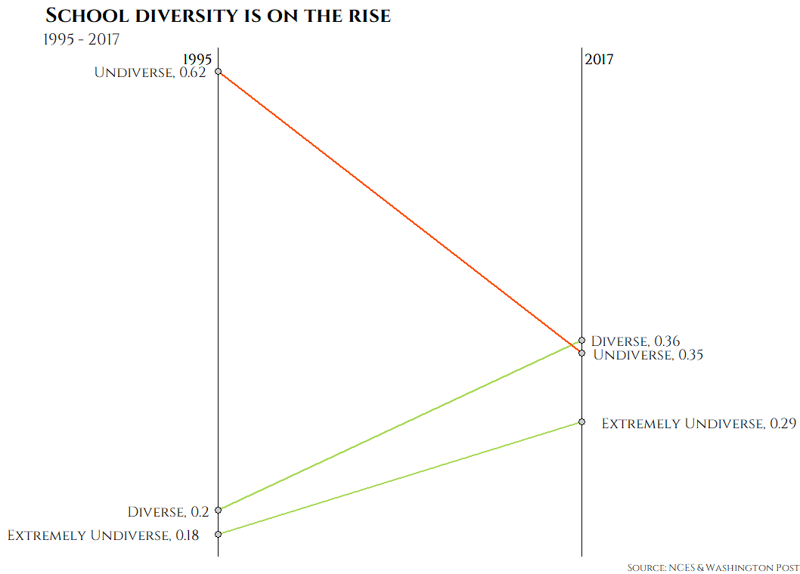

```{r,echo=F}
knitr::opts_chunk$set(warning=F,message=F,echo=F)
```


# 美国校区种族多样性简介  

自 1954 年布朗诉托皮卡教育委员会案正式挑战教育领域内的“隔离但平等”原则以来，美国的黑人等少数族裔开始追求实质上的教育平等权，为后来的种族平权运动奠定了基础。1960 年代，种族定额制全面废除，教育领域内的种族平权在最高法院的判决下得以稳固。21 世纪后，亚裔、拉丁裔等其他少数族裔逐渐在种族平权的斗争中取得了与黑人于非遗可相比拟的地位 [@袁云花2019美国教育领域种族平权研究]。几十年来，美国校园内的种族多样化取得了长足的进步。  

为了衡量任意校区的种族多样程度，采用 **种族多样性指数** (Diversity Index, 简称 DI)， 定义为校区内多数族裔占学生总数的比例。 DI 越小，表明该校区在种族上越多样：  

$$
种族多样性指数 = \frac{多数种族人数}{校区总人数}
$$


根据 DI 的大小，可以将校区分为以下三个"多样(diverse)", "单一(undiverse)"和"extremely undiverse"三个类别：

$$ 校区多样性分类=\left\{
\begin{aligned}
多样(diverse) & = & DI < 75\% \\
单一(undiverse) & = & 75\% \le DI < 90\% \\
极单一(extremely \,undiverse) & = & DI \ge 90\%
\end{aligned}
\right.$$
  

```{r,message=F,warning=F}
library(tidyverse)
library(sf)
library(tidycensus) # state_laea
library(tmap)
library(mapview) # mapview()
library(ggridges)
library(ggrepel)
library(janitor)
```

```{r,message=F}
library(extrafont)
loadfonts() ## You need to do this at the beginning of a session.
```

美国国家教育统计中心(National Center for Education Statistics) 2017 年对全美 13184 个受调查校区中，种族被分为白人、黑人和非裔美国人、西班牙族、亚裔和多种族。 多样校区共 4789 个(36.4%)， 单一校区 4627 个（35.1%），极单一校区 3759 个(28.5%), 相较 1995 年，多样校区占比上升 16.3%, 极单一校区占比下降 27%：  


<center>
```{r}

```
</center>

```{r raw-data}
raw_data <- read_csv("data/student_integration_output.csv") %>%
  janitor::clean_names() %>% 
  mutate(school_year = str_extract(school_year, "\\d{4}$")) %>% 
  rename(year = school_year) %>% 
  mutate(state = fct_recode(st, 
                "Alabama" = "AL", "Alaska" = "AK", "Arizona" = "AZ", "Arkansas" = "AR", 
                "California" = "CA", "Colorado" = "CO", "Connecticut" = "CT", "Delaware" = "DE",                        "Washington D.C." = "DC", "Florida" = "FL", "Georgia" = "GA",    
                "Hawaii" = "HI", "Idaho" = "ID", "Illinois" = "IL", "Indiana" = "IN", "Iowa" = "IA",
                "Kansas" = "KS", "Kentucky" = "KY", "Louisiana" = "LA", "Maine" = "ME", 
                "Maryland" = "MD", "Massachusetts" = "MA", "Michigan" = "MI", "Minnesota" = "MN",                       "Mississippi" = "MS", "Missouri" = "MO", "Montana" = "MT", "Nebraska" = "NE", 
                "Nevada" = "NE", "New Hampshire" = "NH", "New Jersey" = "NJ", "New Mexico" = "NM", 
                "New York" = "NY", "North Carolina" = "NC", "North Dakota"= "ND", "Ohio" = "OH",
                "Oklahoma" = "OK", "Oregon" = "OR", "Pennsylvania" = "PA", "Rhode Island" = "RI", 
                "South Carolina" = "SC", "South Dakota" = "SD", "Tennessee" = "TN", "Texas" = "TX",                     "Utah" = "UT", "Vermont" = "VT", "Virginia" = "VA", "Washington" = "WA", 
                "West Virginia" = "WV", "Wisconsin" = "WI", "Wyoming" = "WY"))
```


```{r ,}
diversity_2017 <- raw_data %>%
  filter(year == 2017)
diversity_1995 <- raw_data %>% 
  filter(year == 1995)
```

```{r diversity-2017-pivoted}
diversity_2017_pivoted <- diversity_2017 %>% 
  pivot_longer(aian:multi, names_to = "race", values_to = "prop")
```

```{r diversity-1995-pivoted}
diversity_1995_pivoted <- diversity_1995 %>% 
  pivot_longer(aian:multi, names_to = "race", values_to = "prop")
```

```{r diversity-2017}
diversity_2017 <- diversity_2017_pivoted %>% 
  group_by(leaid) %>% 
  summarize(DI = max(prop, na.rm = TRUE)/ 100) %>% 
  right_join(diversity_2017)
```

```{r diverstiy-1995}
diversity_1995 <- diversity_1995_pivoted %>% 
  group_by(leaid) %>% 
  summarize(DI = max(prop, na.rm = TRUE)/ 100) %>% 
  right_join(diversity_1995)
```


```{r DI-by-state}
# Diversity was defined by the proportion of students in the dominant racial group. Diverse districts are places where fewer than 75 percent of students are of the same race. Undiverse districts are where 75 to 90 percent of students are the same race. In extremely undiverse districts one racial group constitutes more than 90 percent of students.
DI_by_state_2017 <- diversity_2017 %>% 
  mutate(GEOID = str_sub(leaid, 1, 2)) %>%  # for joining with state_laea
  mutate_at(vars(aian:multi), ~ .x / 100 * total) %>% 
  group_by(st, state, GEOID) %>% 
  summarize_at(vars(aian:multi), sum, na.rm = T) %>% 
  pivot_longer(-c(st, GEOID, state), names_to = "race", values_to = "total") %>% 
  ungroup() %>% 
  group_by(st, state, GEOID) %>% 
  summarize(DI = max(total, na.rm = T) / sum(total, na.rm = T)) %>% 
  ungroup() %>%
  mutate(diverse = factor(ifelse(DI < 0.75, "Diverse", 
                          ifelse(DI < 0.9, "Undiverse", "Extremely Undiverse")),
                          levels = c("Extremely Undiverse", "Undiverse", "Diverse")))

  

DI_by_state_1995 <- diversity_1995 %>% 
  mutate(GEOID = str_sub(leaid, 1, 2)) %>%  # to join with state_laea
  mutate_at(vars(aian:multi), ~ .x / 100 * total) %>% 
  group_by(st, state, GEOID) %>% 
  summarize_at(vars(aian:multi), sum, na.rm = T) %>% 
  pivot_longer(-c(st, state, GEOID), names_to = "race", values_to = "total") %>% 
  ungroup() %>% 
  group_by(st, state, GEOID) %>% 
  summarize(DI = max(total, na.rm = T) / sum(total, na.rm = T)) %>% 
  ungroup() %>%
  mutate(diverse = factor(ifelse(DI < 0.75, "Diverse", 
                          ifelse(DI < 0.9, "Undiverse", "Extremely Undiverse")),
                          levels = c("Extremely Undiverse", "Undiverse", "Diverse")))

DI_by_state_1995[54, ] <- DI_by_state_2017 %>%
  filter(st == "ID")
DI_by_state_1995[54, ]$DI <- NA
DI_by_state_1995[54, ]$diverse <-NA
```


将 DI 汇总至各州(爱达荷州缺失 1995 年的记录), 位于多样的水平的州从 1995 年的 24 个上升到了 2017 年的 41 个，见下表和图:  


```{r state-map, cache = T, fig.height = 8.5, fig.width = 8.5}
state_shape <- state_laea %>% 
  st_transform(2163)

map_by_state_2017 <- state_shape %>% 
  left_join(DI_by_state_1995 %>% 
              mutate(year = 1995) %>% 
              bind_rows(DI_by_state_2017 %>%
                          mutate(year = 2017)))

tmap_mode("plot")
# # tmap_options(bg.color = "skyblue", inner.margins = c(0, .02, .02, .02))
# 
# state_map1 <- tm_shape(map_by_state) + 
#   tm_polygons(col = "diversity",
#               style = "quantile", palette = c("#f7feae","#b7e6a5","#7ccba2",
#                                               "#46aea0","#089099","#00718b","#045275")) +
#   tm_text("st") + 
#   tm_style("natural") + 
# 
#   tm_layout(frame = FALSE)

map_by_state_2017 %>% 
  mutate(DI = round(DI, 2)) %>%
  st_drop_geometry() %>% 
  select(-GEOID, -st, -diverse) %>% 
  pivot_wider(names_from = "year", values_from = "DI") %>% 
  remove_missing() %>% 
  DT::datatable(filter = "bottom")

tm_shape(map_by_state_2017) + 
  tm_polygons(col = "diverse", style = "cat",
              palette = c("#d0587e", "#f7feae", "#88CCEE"),
              title = "Diversity Index",
              legend.is.portrait = FALSE) + 
  tm_text("st", size = "AREA") + 
  tm_style("natural") + 
  tm_compass(type = "8star", position = c(0.1, 0.85), size = 2) +
  tm_layout(frame = FALSE,
            legend.bg.alpha = 0,
            legend.frame = FALSE,
            legend.outside = TRUE,
            main.title = "How diverse are American schools?",
            
            scale = 1.1,
            main.title.size = 2,
            fontfamily = "Cinzel",
            legend.outside.position = "bottom",
            panel.label.size = 1.5,
            panel.label.bg.color = NA) + 
  tm_facets(by = "year", nrow = 1)
```


进一步考虑各州内的学生总数，三种类型学区内部的转化仍呈现类似的变动趋势: 学生总数上升的同时，各州内处于单一校区、极单一校区的人数比例均下降了：

```{r, fig.width = 11,fig.height = 8, cahce = T}
source("ggtern.R")
ggtern_plot
```


# 地域分布特征  

从 DI 的地域分布特征来看，**西部比南部更多样，南部比北部更多样**：

```{r region-map, fig.width = 10, cache = T}
diversity_1995 %>%
  mutate(year = "1995") %>% 
  bind_rows(diversity_2017 %>% 
              mutate(year = "2017")) %>% 
  mutate(GEOID = str_sub(leaid, 1, 2)) %>% 
  left_join(read_csv("data/region.csv")) %>% 
  ggplot(aes(y = REGION, x = DI, fill = year)) + 
  geom_density_ridges(show.legend = FALSE, scale = 1.2) + 
  scale_x_continuous(labels = scales::label_percent(), 
                     breaks = scales::breaks_pretty()) + 
  scale_y_discrete(name = NULL) + 
  scale_fill_manual(values = c("#d0587e", "#88CCEE")) + 
  theme_ridges() + 
  theme(text = element_text(family = "Cinzel")) + 
  labs(title = "All 4 regions are becoming more racially diverse",
       subtitle = "1995 vs. 2017")
```


这样的分布现象当然与美国特有的历史文化传统有关。一些研究同时指出[@fisher2015not;  @cohn201610]，经济水平、开放程度、对移民的吸引力同样是影响一个地区种族多样性的重要因素。**一般而言，地区经济实力越强，对移民吸引力越高，便倾向于有更高的种族多样性**，而这样的客观现实又潜移默化地重塑了该地区的文化观念，形成促进种族多样的良性循环。  

我们分别选出 5 个 “最多样” 和 “最不多样” 的州，一定程度可以印证这种说法，最多样的州（蓝色底色）靠近海岸和边境，不少处于著名的移民城市；而最不多样（红色底色）的州或处于内陆，或人口稀少，经济较为落后(简便起见，图中只给出了$DI > 95\%$ 或者 $DI < 50\%$ 的校区)：  

```{r}
# diversity_2017_pivoted %>%
#   group_by(st, lea_name, leaid) %>%
#   summarize(total = max(total),
#             dominant_total = max(prop / 100) * max(total)) %>%
#   ungroup() %>%
#   group_by(st) %>%
#   summarize(diversity_index_by_state =  sum(dominant_total) /  sum(total)) %>%
#   top_n(desc(5))

# GEOID = c("12", "24", "37", "10", "32")

most_diverse <- diversity_2017 %>% 
  filter(st %in% c("DE", "FL", "MD", "NC", "NV")) %>% 
  select(state, st, lea_name, leaid, DI, d_locale_txt, diverse, total, aian:multi)  

most_diverse_shape <- read_rds("data/most_diverse_shape.rds")

most_diverse_centroid <- most_diverse_shape %>%
  inner_join(most_diverse, by = c("GEOID" = "leaid")) %>%
  st_transform(crs = 2163) %>%
  select(lea_name, state, DI, diverse, aian:multi) %>%
  mutate_at(vars(aian: multi), scales::percent, scale = 1) %>%
  st_centroid() %>% 
  mutate(type = "most")
```


```{r}
# diversity_2017_pivoted %>%
#   group_by(st, lea_name, leaid) %>%
#   summarize(total = max(total),
#             dominant_total = max(prop / 100) * max(total)) %>%
#   ungroup() %>%
#   group_by(st) %>%
#   summarize(diversity_index_by_state =  sum(dominant_total) /  sum(total)) %>%
#   top_n(5)

# GEOID = c("54", "33", "50", "23", "30")

least_diverse <- diversity_2017 %>% 
  filter(st %in% c("ME", "MT", "NH", "VT", "WV")) %>% 
  select(state, lea_name, leaid, DI, d_locale_txt, diverse, total, aian:multi)

least_diverse_shape <- read_rds("data/least_diverse_shape.rds")

least_diverse_centroid <- least_diverse_shape %>%
  inner_join(least_diverse, by = c("GEOID" = "leaid")) %>%
  st_transform(crs = 2163) %>%
  select(lea_name, state, DI, diverse, aian:multi) %>%
  mutate_at(vars(aian: multi), scales::percent, scale = 1) %>%
  st_centroid() %>% 
  mutate(type = "least")
```


```{r,fig.width=10}
combined_centroid <- most_diverse_centroid %>% 
  rbind(least_diverse_centroid)


combined_centroid_map <- mapview(state_laea %>% 
          filter(GEOID %in% c(12, 24, 37, 10, 32, 
                              54, 33, 50, 23, 30)) %>% 
    mutate(type = if_else(GEOID %in% c(12, 24, 37, 10, 32), "最多样", "最不多样")),
    zcol = "type",
    legend = TRUE,
    layer.name = "",
    map.type = "Stamen.Toner",
    col.region = c("#d0587e", "#88CCEE")) + 
    mapview(combined_centroid %>% filter(DI > 0.95 | DI < 0.5), legend = FALSE,
            cex = 3) 

combined_centroid_map
```


# 其他影响因素  

一般认为，一个地区在不同种族上的人口分布越平均，工资差距越小，种族多样程度也也该越好。然而，结合 2017 年美国社区调查提供的收入和人口统计，却能发现两个与常识相违背的趋势：一个洲内部各种族人口总数差距越大，多样性却越好；同样，一个州内不同种族的工资（中位数）分布越极端，多样性也越好。  

@taeuber2008residential 针对这种反常的现象提供了一些解释，例如人口分布更极端的州内的少数族群往往有高于平均水平的社会经济地位，导致多样性反而上升了；以及种族之间单纯的平行工资比较未必能真正揭示经济水平上的差异，容易出现"虚高"和“虚低”的现象。  

也有一些学者认为这种现象属于一种合成谬误[@holme2013school]，即在校区汇总到州的过程中出现了对事实的扭曲，然而目前同样缺少大范围的实证研究证实这种谬误的存在性。  

## 住地种族分布  {.tabset .tabset-fade .tabset-pills}  

美国社会调查提供了每个校区范围内的白人、黑人和非裔美国人、亚裔、印第安人和阿拉斯加原住民、其他族裔和多族裔的人口，分别算出各州人口分布的极差和标准差，对 DI 做散点图：  

```{r}
res_seg <- read_rds("res_seg.rds") %>% 
  select(-moe) %>% 
  group_by(GEOID, NAME) %>% 
  summarize(rng = max(estimate, na.rm = T) - min(estimate, na.rm = T),
            sd = sd(estimate, na.rm = T),
            iqr = IQR(estimate, na.rm = T)) %>% 
  left_join(map_by_state_2017 %>% filter(year == 2017)) %>% 
  select(-NAME, -year, -geometry) %>% 
  left_join(total_student_by_state %>% filter(year == 2017)) %>% 
  select(-year)
```
### 极差

```{r, fig.height=6}
ggplot(res_seg) + 
  geom_point(aes(rng, DI, size = total, fill = DI), shape = 21, color = "black") + 
  scale_x_continuous("range of ethnical population (log10)",
                     trans = "log10",
                     labels = label_number_si()) + 
  geom_smooth(aes(rng, DI), method = "lm") + 
  scale_size(name = "# of students",
             range = c(1, 10), labels = label_number_si()) + 
  scale_fill_viridis(name = "DI",
                     option = "A", 
                     labels = label_percent(),
                     breaks = breaks_width(0.2)) + 
  scale_y_continuous(labels = label_percent(accuracy = 1)) + 
  theme(text = element_text("Cinzel", size = 18),
        legend.text = element_text(size = 8),
        panel.background = element_blank(),
        legend.position = "top",
        legend.key = element_blank(),
        legend.title = element_text(vjust = 0.75),
        axis.title = element_text(size = 12),
        plot.caption = element_text(size = 10)) + 
  labs(title = "Comparing residential segregation with DI",
       subtitle = "range vs. DI",
       caption = "Source: NCES & Washington Post & 2017 ACS")
```

### 标准差

```{r,fig.height=6,fig.width=10}
ggplot(res_seg) + 
  geom_point(aes(sd, DI, size = total, fill = DI), shape = 21, color = "black") + 
  scale_x_continuous("standard deviation of ethnical population",
                     trans = "log10",
                     labels = label_number_si()) + 
  geom_smooth(aes(rng, DI), method = "lm") + 
  scale_size(name = "# of students",
             range = c(1, 10), labels = label_number_si()) + 
  scale_fill_viridis(name = "DI",
                     option = "A", 
                     labels = label_percent(),
                     breaks = breaks_width(0.2)) + 
  scale_y_continuous(labels = label_percent(accuracy = 1)) + 
  theme(text = element_text("Cinzel", size = 18),
        legend.text = element_text(size = 8),
        panel.background = element_blank(),
        legend.position = "top",
        legend.key = element_blank(),
        legend.title = element_text(vjust = 0.75),
        axis.title = element_text(size = 12),
        plot.caption = element_text(size = 10)) + 
  labs(title = "Comparing residential segregation with DI",
       subtitle = " standard deviation vs. DI",
       caption = "Source: NCES & Washington Post % 2017 ACS")
```


## 收入差距 {.tabset .tabset-fade .tabset-pills}  

美国社会调查提供了每个校区范围内的白人、黑人和非裔美国人、西班牙裔、亚裔、印第安人和阿拉斯加原住民、其他族裔和多族裔的工资中位数，分别算出各州工资中位数分布的极差和标准差，对 DI 做散点图：  


```{r income-income}  

income <- read_rds("income.rds") %>% 
  select(-moe) %>% 
  group_by(GEOID, NAME) %>% 
  summarize(income = head(estimate, 1),
            rng = max(estimate, na.rm = T) - min(estimate, na.rm = T),
            sd = sd(estimate, na.rm = T),
            iqr = IQR(estimate, na.rm = T)) %>% 
  left_join(map_by_state_2017 %>% filter(year == 2017)) %>% 
  select(-year, -geometry) %>% 
  left_join(total_student_by_state %>% filter(year == 2017)) %>% 
  select(-year)
```


### 极差

```{r, fig.height=6,fig.width=10}
ggplot(income) + 
  geom_point(aes(rng, DI, size = total, fill = DI), shape = 21, color = "black") + 
  geom_smooth(aes(rng, DI), method = "lm") + 
  scale_size(name = "# of students",
             range = c(1, 10), labels = label_number_si()) + 
  scale_x_continuous(name = "range of median income by race(log10)",
                     trans = "log10",
                     labels = label_number_si()) +
  scale_fill_viridis(name = "DI",
                     option = "A", 
                     labels = label_percent(),
                     breaks = breaks_width(0.2)) + 
  scale_y_continuous(labels = label_percent(accuracy = 1)) + 
  theme(text = element_text("Cinzel", size = 18),
        legend.text = element_text(size = 8),
        panel.background = element_blank(),
        legend.position = "top",
        legend.key = element_blank(),
        legend.title = element_text(vjust = 0.75),
        axis.title = element_text(size = 12),
        plot.caption = element_text(size = 10)) + 
  labs(title = "Comparing income gap with DI",
       subtitle = "range vs. DI",
       caption = "Source: NCES & Washington Post & 2017 ACS")
```

### 标准差  

```{r,fig.height=6}
ggplot(income) + 
  geom_point(aes(sd, DI, size = total, fill = DI), shape = 21, color = "black") + 
  geom_smooth(aes(sd, DI), method = "lm") + 
  scale_size(name = "# of students",
             range = c(1, 10), labels = label_number_si()) + 
  scale_x_continuous(name = "standard deviation of median income by race (log10)",
                     trans = "log10",
                     labels = label_number_si()) + 
  scale_fill_viridis(name = "DI",
                     option = "A", 
                     labels = label_percent(),
                     breaks = breaks_width(0.2)) + 
  scale_y_continuous(labels = label_percent(accuracy = 1)) + 
  theme(text = element_text("Cinzel", size = 18),
        legend.text = element_text(size = 8),
        panel.background = element_blank(),
        legend.position = "top",
        legend.key = element_blank(),
        legend.title = element_text(vjust = 0.75),
        axis.title = element_text(size = 12),
        plot.caption = element_text(size = 10)) + 
  labs(title = "Comparing income gap with DI",
       subtitle = "standard deviation vs. DI",
       caption = "Source: NCES & Washington Post & 2017 ACS")
```


`r if (knitr::is_html_output()) '# References {-}'`  

Washington Post:  [How the nation’s growing racial
diversity is changing our schools](https://www.washingtonpost.com/graphics/2019/local/school-diversity-data/)     

ProPublica: [the resegregation of American schools](https://www.propublica.org/article/segregation-now-the-resegregation-of-americas-schools/#intro)  

ProPublica: [Reading Guide: Segregation in America](https://www.propublica.org/article/reading-guide-segregation-in-america)  


